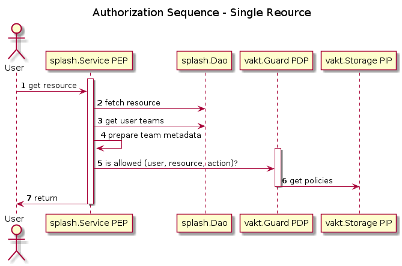
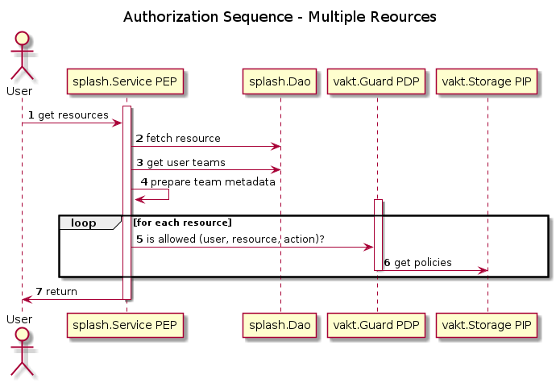
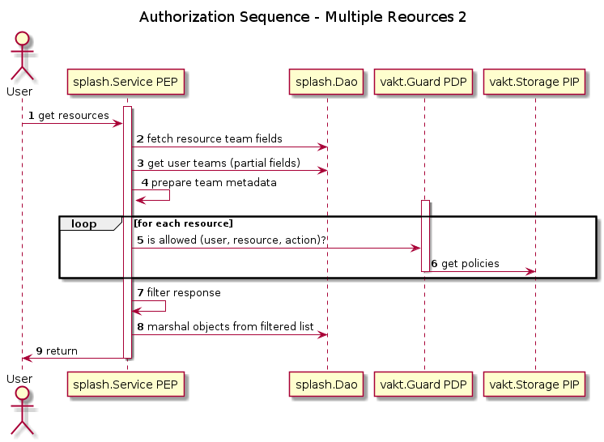

Authorization in splash accomplished with the help of [vakt](https://github.com/kolotaev/vakt). The current system combines a team membership model (which is somewhat but not quite RBAC-like) with Policy rules stored in the vakt Policy Information Point and checked using the vakt Policy Decision Point. Splash provies a thin API layor on top of vakt for flexibility.

Mixing teams/groups/roles with ABAC authentication mimics [AWS IAM](https://docs.aws.amazon.com/IAM/latest/UserGuide/tutorial_attribute-based-access-control.html) functionality. We choose Teams as a fundamental model class in our system as it matches well with the worfklow of multiple users from multiple groups who are given access to data taken at beamlines and end stations. Teams can contain teams and users. 

This document adopts some of the terminology of ABAC / XACML systems, specifically:

PEP
:  Policy Enforcement Point

PDP
: Policy Decision Point

PIP
: Policy Information Point

# Single Resource Sequence
When a user requests a resource, the following ocurrs:



1. User requests a resource
2. The splash.Service, acting as the Policy Enforcement Point.
3. The splash.Service talks to the persisence layer (splash.Dao) to get the user's team membership information.
4. The splash.Service prepares team membership data for consumption by the PDP. This involves parparing the resource object in the request with a list of teams that the user belongs to, as well as their role within that team.

```
  user: {
      teams: [
          {'slartibartfast_group': 'member', 'admin'}, 
          {'beamline_42': 'member'},
          {'lightsource_1': 'member'}
      ]
  }
```

This information about the resource will be extracted:
```
    resource: {'proposal_id': 'slartibartfast_group'}
```

These will be sent to the PDP, which might contain a rule that says something like:


```
if action == 'view' and
    if resource.proposal_id is in teams:
        return Approved

```

# Multiple Resource Sequence
Often times, access privilages must be checked for multiple items within the same reuqest. In these cases, the sequence is similar, though the check will have to be performed multiple times. 



# Alternate Multiple Resource Check
Marshalling all resources for a query only to have a subset be returned maybe is not most efficient possible query processing setup. We might envision adding a step to marshal just the beamline data for each resource then querying for more fields.


